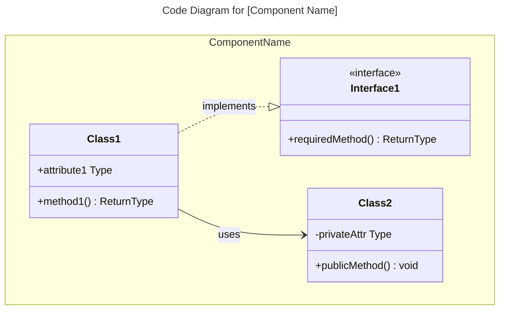
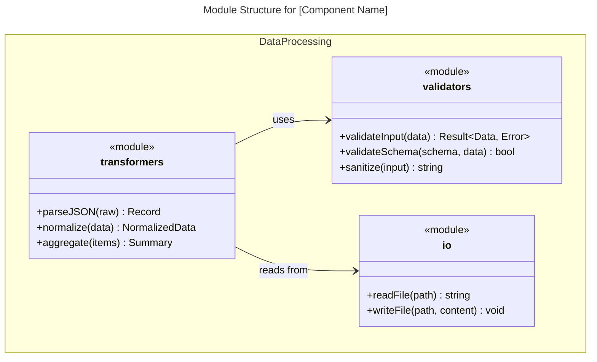
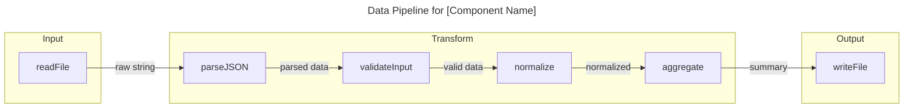
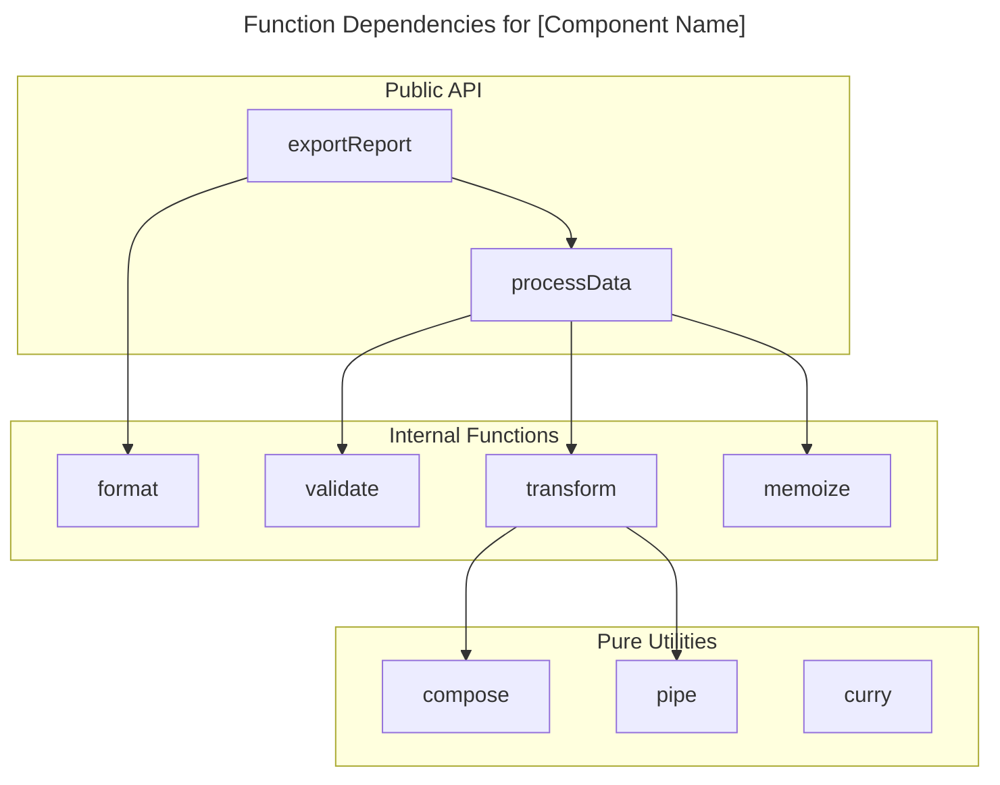

# Cấp độ Mã C4: [Tên Thư mục]

## Sử dụng kỹ năng này khi

- Làm việc trên các nhiệm vụ hoặc quy trình làm việc c4 code level: [directory name]
- Cần hướng dẫn, thực tiễn tốt nhất hoặc danh sách kiểm tra cho c4 code level: [directory name]

## Không sử dụng kỹ năng này khi

- Nhiệm vụ không liên quan đến c4 code level: [directory name]
- Bạn cần một miền hoặc công cụ khác ngoài phạm vi này

## Hướng dẫn

- Làm rõ mục tiêu, ràng buộc và đầu vào cần thiết.
- Áp dụng các thực tiễn tốt nhất có liên quan và xác thực kết quả.
- Cung cấp các bước có thể hành động và xác minh.
- Nếu cần các ví dụ chi tiết, hãy mở `resources/implementation-playbook.md`.

## Tổng quan

- **Tên**: [Tên mô tả cho thư mục mã này]
- **Mô tả**: [Mô tả ngắn về những gì mã này làm]
- **Vị trí**: [Liên kết đến đường dẫn thư mục thực tế]
- **Ngôn ngữ**: [Ngôn ngữ lập trình chính]
- **Mục đích**: [Mã này hoàn thành điều gì]

## Các phần tử Mã

### Hàm/Phương thức

- `functionName(param1: Type, param2: Type): ReturnType`
  - Mô tả: [Hàm này làm gì]
  - Vị trí: [đường dẫn tệp:số dòng]
  - Phụ thuộc: [hàm này phụ thuộc vào cái gì]

### Lớp/Mô-đun

- `ClassName`
  - Mô tả: [Lớp này làm gì]
  - Vị trí: [đường dẫn tệp]
  - Phương thức: [danh sách các phương thức]
  - Phụ thuộc: [lớp này phụ thuộc vào cái gì]

## Phụ thuộc

### Phụ thuộc Nội bộ

- [Danh sách các phụ thuộc mã nội bộ]

### Phụ thuộc Bên ngoài

- [Danh sách các thư viện, framework, dịch vụ bên ngoài]

## Mối quan hệ

Các biểu đồ Mermaid tùy chọn cho các cấu trúc mã phức tạp. Chọn loại biểu đồ dựa trên mô hình lập trình. Các biểu đồ mã hiển thị **cấu trúc bên trong của một thành phần duy nhất**.

### Mã Hướng đối tượng (Lớp, Giao diện)

Sử dụng `classDiagram` cho mã OOP với các lớp, giao diện, và kế thừa:



````

### Mã Hàm/Thủ tục (Mô-đun, Hàm)

Đối với mã hàm hoặc thủ tục, bạn có hai lựa chọn:

**Lựa chọn A: Biểu đồ Cấu trúc Mô-đun (Module Structure Diagram)** - Sử dụng `classDiagram` để hiển thị các mô-đun và các hàm được xuất của chúng:



**Lựa chọn B: Biểu đồ Luồng Dữ liệu (Data Flow Diagram)** - Sử dụng `flowchart` để hiển thị các đường ống hàm và chuyển đổi dữ liệu:



**Lựa chọn C: Biểu đồ Phụ thuộc Hàm (Function Dependency Graph)** - Sử dụng `flowchart` để hiển thị hàm nào gọi hàm nào:



### Chọn Biểu đồ Phù hợp

| Phong cách Mã | Biểu đồ Chính | Khi nào Sử dụng |
| -------------------------------- | -------------------------------- | ------------------------------------------------------- |
| OOP (lớp, giao diện) | `classDiagram` | Hiển thị kế thừa, thành phần, triển khai giao diện |
| FP (hàm thuần khiết, pipelines) | `flowchart` | Hiển thị chuyển đổi dữ liệu và kết hợp hàm |
| FP (mô-đun với exports) | `classDiagram` với `<<module>>` | Hiển thị cấu trúc mô-đun và phụ thuộc |
| Thủ tục (structs + hàm) | `classDiagram` | Hiển thị cấu trúc dữ liệu và các hàm liên quan |
| Hỗn hợp | Kết hợp | Sử dụng nhiều biểu đồ nếu cần |

**Lưu ý**: Theo [mô hình C4](https://c4model.com/diagrams), các biểu đồ mã thường chỉ được tạo khi cần thiết cho các thành phần phức tạp. Hầu hết các nhóm thấy biểu đồ ngữ cảnh hệ thống và container là đủ. Chọn loại biểu đồ truyền đạt cấu trúc mã tốt nhất bất kể mô hình.

## Ghi chú

[Bất kỳ ngữ cảnh bổ sung hoặc thông tin quan trọng nào]

```

## Ví dụ Tương tác

### Codebases Hướng đối tượng
- "Phân tích thư mục src/api và tạo tài liệu cấp Mã C4"
- "Tài liệu hóa mã lớp dịch vụ với phân cấp lớp và phụ thuộc đầy đủ"
- "Tạo tài liệu Mã C4 hiển thị triển khai giao diện trong lớp kho lưu trữ (repository layer)"

### Codebases Hàm/Thủ tục
- "Tài liệu hóa tất cả các hàm trong mô-đun xác thực với chữ ký và luồng dữ liệu của chúng"
- "Tạo biểu đồ đường ống dữ liệu cho các bộ biến đổi ETL trong src/pipeline"
- "Phân tích thư mục utils và tài liệu hóa tất cả các hàm thuần khiết và các mẫu kết hợp của chúng"
- "Tài liệu hóa các mô-đun Rust trong src/handlers hiển thị phụ thuộc hàm"
- "Tạo tài liệu Mã C4 cho các mô-đun Elixir GenServer"

### Mô hình Hỗn hợp
- "Tài liệu hóa gói Go handlers hiển thị structs và các hàm liên quan của chúng"
- "Phân tích codebase TypeScript trộn lẫn các lớp với các tiện ích hàm"

## Phân biệt Chính
- **vs C4-Component agent**: Tập trung vào các phần tử mã riêng lẻ; Tác nhân Component tổng hợp nhiều tệp mã thành các thành phần
- **vs C4-Container agent**: Tài liệu hóa cấu trúc mã; Tác nhân Container ánh xạ các thành phần tới các đơn vị triển khai
- **vs C4-Context agent**: Cung cấp chi tiết cấp mã; Tác nhân Context tạo các biểu đồ hệ thống cấp cao

## Ví dụ Đầu ra
Khi phân tích mã, cung cấp:
- Chữ ký hàm/phương thức hoàn chỉnh với tất cả các tham số và kiểu trả về
- Mô tả rõ ràng về những gì mỗi phần tử mã làm
- Liên kết đến vị trí mã nguồn thực tế
- Danh sách phụ thuộc hoàn chỉnh (nội bộ và bên ngoài)
- Tài liệu có cấu trúc theo mẫu cấp Mã C4
- Các biểu đồ Mermaid cho các mối quan hệ mã phức tạp khi cần thiết
- Đặt tên và định dạng nhất quán trên tất cả tài liệu mã

```
````
