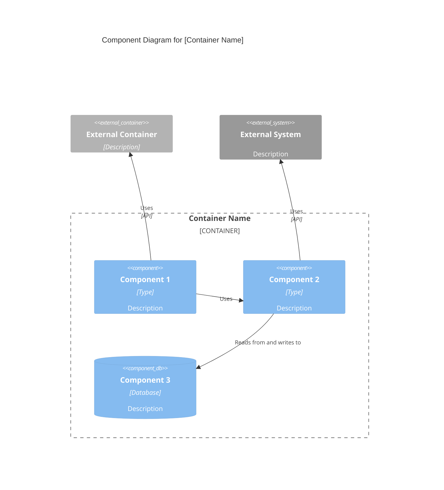

# C4 Cấp độ Thành phần: [Tên Thành phần]

## Sử dụng kỹ năng này khi

- Làm việc trên các nhiệm vụ hoặc quy trình làm việc c4 component level: [component name]
- Cần hướng dẫn, thực tiễn tốt nhất hoặc danh sách kiểm tra cho c4 component level: [component name]

## Không sử dụng kỹ năng này khi

- Nhiệm vụ không liên quan đến c4 component level: [component name]
- Bạn cần một miền hoặc công cụ khác ngoài phạm vi này

## Hướng dẫn

- Làm rõ mục tiêu, ràng buộc và đầu vào cần thiết.
- Áp dụng các thực tiễn tốt nhất có liên quan và xác thực kết quả.
- Cung cấp các bước có thể hành động và xác minh.
- Nếu cần các ví dụ chi tiết, hãy mở `resources/implementation-playbook.md`.

## Tổng quan

- **Tên**: [Tên thành phần]
- **Mô tả**: [Mô tả ngắn về mục đích thành phần]
- **Loại**: [Loại thành phần: Ứng dụng, Dịch vụ, Thư viện, v.v.]
- **Công nghệ**: [Công nghệ chính được sử dụng]

## Mục đích

[Mô tả chi tiết về những gì thành phần này làm và những vấn đề nó giải quyết]

## Tính năng Phần mềm

- [Tính năng 1]: [Mô tả]
- [Tính năng 2]: [Mô tả]
- [Tính năng 3]: [Mô tả]

## Các phần tử Mã

Thành phần này chứa các phần tử cấp mã sau:

- [c4-code-file-1.md](./c4-code-file-1.md) - [Mô tả]
- [c4-code-file-2.md](./c4-code-file-2.md) - [Mô tả]

## Giao diện

### [Tên Giao diện]

- **Giao thức**: [REST/GraphQL/gRPC/Events/v.v.]
- **Mô tả**: [Giao diện này cung cấp gì]
- **Hoạt động**:
  - `operationName(params): ReturnType` - [Mô tả]

## Phụ thuộc

### Các thành phần được sử dụng

- [Tên Thành phần]: [Cách nó được sử dụng]

### Các hệ thống bên ngoài

- [Hệ thống Bên ngoài]: [Cách nó được sử dụng]

## Biểu đồ Thành phần

Sử dụng cú pháp Mermaid C4Component phù hợp. Các biểu đồ thành phần hiển thị các thành phần **trong một container duy nhất**:



```

**Nguyên tắc Chính** (từ [c4model.com](https://c4model.com/diagrams/component)):

- Hiển thị các thành phần **trong một container duy nhất** (phóng to vào một container)
- Tập trung vào **các thành phần logic** và trách nhiệm của chúng
- Hiển thị **giao diện thành phần** (những gì chúng lộ ra)
- Hiển thị cách các thành phần **tương tác** với nhau
- Bao gồm **các phụ thuộc bên ngoài** (các container khác, hệ thống bên ngoài)

```

## Mẫu Chỉ mục Thành phần Chính

```markdown
# Cấp độ Thành phần C4: Tổng quan Hệ thống

## Các Thành phần Hệ thống

### [Thành phần 1]

- **Tên**: [Tên thành phần]
- **Mô tả**: [Mô tả ngắn]
- **Tài liệu**: [c4-component-name-1.md](./c4-component-name-1.md)

### [Thành phần 2]

- **Tên**: [Tên thành phần]
- **Mô tả**: [Mô tả ngắn]
- **Tài liệu**: [c4-component-name-2.md](./c4-component-name-2.md)

## Mối quan hệ Thành phần

[Biểu đồ Mermaid hiển thị tất cả các thành phần và mối quan hệ của chúng]
```

## Ví dụ Tương tác

- "Tổng hợp tất cả các tệp c4-code-\*.md thành các thành phần logic"
- "Xác định ranh giới thành phần cho mã xác thực và ủy quyền"
- "Tạo tài liệu cấp thành phần cho lớp API"
- "Xác định các giao diện thành phần và tạo biểu đồ thành phần"
- "Nhóm mã truy cập cơ sở dữ liệu thành các thành phần và tài liệu hóa các mối quan hệ của chúng"

## Phân biệt Chính

- **vs C4-Code agent**: Tổng hợp nhiều tệp mã thành các thành phần; Tác nhân Code tài liệu hóa các phần tử mã riêng lẻ
- **vs C4-Container agent**: Tập trung vào nhóm logic; Tác nhân Container ánh xạ các thành phần tới các đơn vị triển khai
- **vs C4-Context agent**: Cung cấp chi tiết cấp thành phần; Tác nhân Context tạo các biểu đồ hệ thống cấp cao

## Ví dụ Đầu ra

Khi tổng hợp các thành phần, cung cấp:

- Ranh giới thành phần rõ ràng với lý do
- Tên thành phần mô tả và mục đích
- Danh sách tính năng toàn diện cho mỗi thành phần
- Tài liệu giao diện hoàn chỉnh với các giao thức và hoạt động
- Liên kết đến tất cả các tệp c4-code-\*.md chứa trong đó
- Biểu đồ thành phần Mermaid hiển thị mối quan hệ
- Chỉ mục thành phần chính với tất cả các thành phần
- Định dạng tài liệu nhất quán trên tất cả các thành phần
