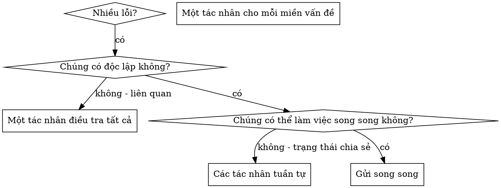

# Gửi Các Tác Nhân Song Song (Dispatching Parallel Agents)

## Tổng quan

Khi bạn có nhiều lỗi không liên quan (các tệp kiểm thử khác nhau, các hệ thống con khác nhau, các lỗi khác nhau), việc điều tra chúng một cách tuần tự sẽ lãng phí thời gian. Mỗi cuộc điều tra là độc lập và có thể diễn ra song song.

**Nguyên tắc cốt lõi:** Gửi một tác nhân cho mỗi miền vấn đề độc lập. Hãy để chúng làm việc đồng thời.

## Khi nào Sử dụng



**Sử dụng khi:**

- 3+ tệp kiểm thử thất bại với các nguyên nhân gốc rễ khác nhau
- Nhiều hệ thống con bị hỏng độc lập
- Mỗi vấn đề có thể được hiểu mà không cần bối cảnh từ những người khác
- Không có trạng thái chia sẻ giữa các cuộc điều tra

**Không sử dụng khi:**

- Các lỗi có liên quan (sửa lỗi này có thể sửa lỗi khác)
- Cần hiểu toàn bộ trạng thái hệ thống
- Các tác nhân sẽ can thiệp lẫn nhau

## Mẫu (The Pattern)

### 1. Xác định Các Miền Độc lập

Nhóm các lỗi theo những gì bị hỏng:

- Kiểm thử Tệp A: Luồng phê duyệt công cụ
- Kiểm thử Tệp B: Hành vi hoàn thành hàng loạt
- Kiểm thử Tệp C: Chức năng hủy bỏ

Mỗi miền là độc lập - sửa lỗi phê duyệt công cụ không ảnh hưởng đến các kiểm thử hủy bỏ.

### 2. Tạo Các Nhiệm vụ Tác nhân Tập trung

Mỗi tác nhân nhận được:

- **Phạm vi cụ thể:** Một tệp kiểm thử hoặc hệ thống con
- **Mục tiêu rõ ràng:** Làm cho các kiểm thử này vượt qua
- **Ràng buộc:** Không thay đổi mã khác
- **Đầu ra mong đợi:** Tóm tắt những gì bạn đã tìm thấy và sửa chữa

### 3. Gửi Song song

```typescript
// In Claude Code / AI environment
Task("Fix agent-tool-abort.test.ts failures");
Task("Fix batch-completion-behavior.test.ts failures");
Task("Fix tool-approval-race-conditions.test.ts failures");
// All three run concurrently
```

### 4. Xem xét và Tích hợp

Khi các tác nhân quay lại:

- Đọc từng tóm tắt
- Xác minh các bản sửa lỗi không xung đột
- Chạy bộ kiểm thử đầy đủ
- Tích hợp tất cả các thay đổi

## Cấu trúc Lời nhắc Tác nhân

Các lời nhắc tác nhân tốt là:

1. **Tập trung** - Một miền vấn đề rõ ràng
2. **Khép kín** - Tất cả bối cảnh cần thiết để hiểu vấn đề
3. **Cụ thể về đầu ra** - Tác nhân nên trả về cái gì?

```markdown
Fix the 3 failing tests in src/agents/agent-tool-abort.test.ts:

1. "should abort tool with partial output capture" - expects 'interrupted at' in message
2. "should handle mixed completed and aborted tools" - fast tool aborted instead of completed
3. "should properly track pendingToolCount" - expects 3 results but gets 0

These are timing/race condition issues. Your task:

1. Read the test file and understand what each test verifies
2. Identify root cause - timing issues or actual bugs?
3. Fix by:
   - Replacing arbitrary timeouts with event-based waiting
   - Fixing bugs in abort implementation if found
   - Adjusting test expectations if testing changed behavior

Do NOT just increase timeouts - find the real issue.

Return: Summary of what you found and what you fixed.
```

## Các Sai lầm Thường gặp

**❌ Quá rộng:** "Sửa tất cả các kiểm thử" - tác nhân bị lạc
**✅ Cụ thể:** "Sửa agent-tool-abort.test.ts" - phạm vi tập trung

**❌ Không có bối cảnh:** "Sửa lỗi race condition" - tác nhân không biết ở đâu
**✅ Bối cảnh:** Dán các thông báo lỗi và tên kiểm thử

**❌ Không có ràng buộc:** Tác nhân có thể cấu trúc lại mọi thứ
**✅ Ràng buộc:** "KHÔNG thay đổi mã sản xuất" hoặc "Chỉ sửa các kiểm thử"

**❌ Đầu ra mơ hồ:** "Sửa nó" - bạn không biết những gì đã thay đổi
**✅ Cụ thể:** "Trả về tóm tắt nguyên nhân gốc rễ và các thay đổi"

## Khi nào KHÔNG nên Sử dụng

**Các lỗi liên quan:** Sửa lỗi này có thể sửa lỗi khác - điều tra cùng nhau trước
**Cần bối cảnh đầy đủ:** Hiểu biết đòi hỏi phải xem toàn bộ hệ thống
**Gỡ lỗi thăm dò:** Bạn chưa biết cái gì bị hỏng
**Trạng thái chia sẻ:** Các tác nhân sẽ can thiệp (chỉnh sửa cùng một tệp, sử dụng cùng một tài nguyên)

## Ví dụ Thực tế từ Phiên làm việc

**Kịch bản:** 6 lỗi kiểm thử trên 3 tệp sau khi cấu trúc lại lớn

**Các lỗi:**

- agent-tool-abort.test.ts: 3 lỗi (vấn đề thời gian)
- batch-completion-behavior.test.ts: 2 lỗi (công cụ không thực thi)
- tool-approval-race-conditions.test.ts: 1 lỗi (số lượng thực thi = 0)

**Quyết định:** Các miền độc lập - logic hủy bỏ tách biệt với hoàn thành hàng loạt tách biệt với các điều kiện race

**Gửi:**

```
Agent 1 → Fix agent-tool-abort.test.ts
Agent 2 → Fix batch-completion-behavior.test.ts
Agent 3 → Fix tool-approval-race-conditions.test.ts
```

**Kết quả:**

- Agent 1: Đã thay thế timeout bằng chờ dựa trên sự kiện
- Agent 2: Đã sửa lỗi cấu trúc sự kiện (threadId ở sai chỗ)
- Agent 3: Đã thêm chờ cho thực thi công cụ không đồng bộ hoàn tất

**Tích hợp:** Tất cả các bản sửa lỗi độc lập, không xung đột, bộ kiểm thử đầy đủ xanh

**Thời gian tiết kiệm được:** 3 vấn đề được giải quyết song song so với tuần tự

## Lợi ích Chính

1. **Song song hóa** - Nhiều cuộc điều tra diễn ra đồng thời
2. **Tập trung** - Mỗi tác nhân có phạm vi hẹp, ít bối cảnh phải theo dõi hơn
3. **Độc lập** - Các tác nhân không can thiệp lẫn nhau
4. **Tốc độ** - 3 vấn đề được giải quyết trong thời gian của 1

## Xác minh

Sau khi các tác nhân quay lại:

1. **Xem xét từng tóm tắt** - Hiểu những gì đã thay đổi
2. **Kiểm tra xung đột** - Các tác nhân có chỉnh sửa cùng một mã không?
3. **Chạy bộ kiểm thử đầy đủ** - Xác minh tất cả các bản sửa lỗi hoạt động cùng nhau
4. **Kiểm tra điểm** - Các tác nhân có thể mắc lỗi hệ thống

## Tác động Thế giới Thực

Từ phiên gỡ lỗi (2025-10-03):

- 6 lỗi trên 3 tệp
- 3 tác nhân được gửi song song
- Tất cả các cuộc điều tra hoàn tất đồng thời
- Tất cả các bản sửa lỗi được tích hợp thành công
- Không có xung đột giữa các thay đổi của tác nhân
